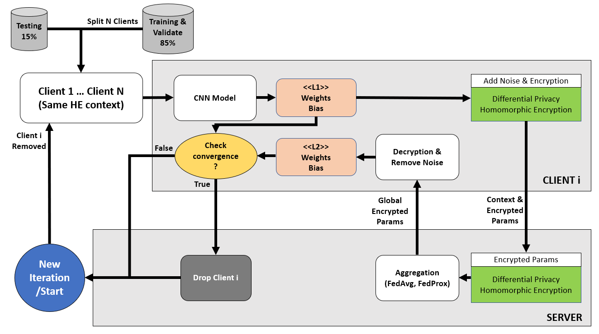

# Specialized project: Enhancing Privacy Preservation of Federated Learning for Intrusion Detection System
## Introduction
This is the source code for the specialized project developed by my partner and me. Our research is still in progress. 

In this project, I built a Federated Learning (FL) architecture and used Convolutional Neural Network (CNN) deep learning algorithm for model training on CICIoT2023 dataset. Specifically, my research focused on optimizing training time, model size, or the performance of trained models... Ultimately, the main objective of this project was to integrate privacy preservation measures such as Differential Privacy and Homomorphic Encryption into the model exchange process between clients and the server in the FL architecture, in order to enhance the safety and confidentiality of this process. At the same time, the another goal was to ensure the model’s integrity are preserved after the exchange. 

The source code in this repository includes the entire implementation of our research. If you find it helpful for your own research, feel free to refer to it, but please make sure to cite our paper and star my repo. It will motivate me a lot ☺️. Thank youuu!!! Currently, I haven't written a paper for this research yet, but I will update this section once I do in the future.

## Contributors
| Contributor        | Contact  | 
| ------------------ | -------- | 
| [VoNguyenThaiHoc](https://github.com/HocVoNgThai) | [vonguyenthaihocilt260@gmail.com](mailto:vonguyenthaihocilt260@gmail.com) |
| [VoNhatHoang](https://github.com/VoNhtHoang) | [22520481@gm.uit.edu.vn](mailto:22520481@gm.uit.edu.vn) |

## Requirements
You can run the programs in the source code on platforms such as Kaggle, Google Colab, or any other platform that supports running with GPU. As for me, I train locally on a WSL2 environment. About environment setup, i followed tutorial from this [repo](https://github.com/mahbub-aumi/tensorflow-cuda-wsl-ubuntu24.04) and [video](https://youtu.be/VOJq98BLjb8?si=fHDSOZ6bB1XfUJlB). You can follow this to set up the environment yourself. In addition, you’ll also need to run the following command to install the required libraries:
```
bash install.sh
```
## Federated learning architecture


## Dataset and Data processing
We use CICIoT2023 dataset for training and evaluating process. In this repo, I dont public the dataset after processing but in the [Dataset_Processing](https://github.com/HocVoNgThai/Enhancing-Privacy-Preservation-of-Federated-Learning-for-Intrusion-Detection-System/tree/main/Dataset_Processing) folder, i have shown you every thing i did in this step to create the own final training dataset. Involve extracting the appropriate number of samples, remapping the labels, shuffling and scaling the dataset. 

## Centralized training
In [Centralize_CNN](https://github.com/HocVoNgThai/Enhancing-Privacy-Preservation-of-Federated-Learning-for-Intrusion-Detection-System/tree/main/Centralize_CNN) folder, i have provided two notebooks. The first one, i just trained with a binary dataset, it only have 2 label is benign and DDoS. The second one is training with multi-label dataset, this dataset have 5 labels: Mirai, Spoofing, Recon, DDoS and Benign. The notebooks in this folder are used for testing CNN model to find out which CNN model is the best for training with our dataset.

## Decentralized training
Three folders are [FL_Simulation_Have_DP](https://github.com/HocVoNgThai/Enhancing-Privacy-Preservation-of-Federated-Learning-for-Intrusion-Detection-System/tree/main/FL_Simulation_Have_DP), [FL_Simulation_no_DP](https://github.com/HocVoNgThai/Enhancing-Privacy-Preservation-of-Federated-Learning-for-Intrusion-Detection-System/tree/main/FL_Simulation_No_PP), [FL_Simulation_MultiClass](https://github.com/HocVoNgThai/Enhancing-Privacy-Preservation-of-Federated-Learning-for-Intrusion-Detection-System/tree/main/FL_Simulation_MultiClass) contain the main source code in my our research. The first two folders contain the source code I used to test with the binary dataset. In these experiments, I conducted runs both without applying any privacy preservation (PP) methods during the model exchange process and with Differential Privacy (DP) integrated into this process. The last folder, I tested with multi-label dataset, and this time I integrated both Differential Privacy (DP) and Homomorphic Encryption (HE) into the model exchange process.

## Log Storage
Finally, I use fours folders to storage logs and trained models from three different kinds of training process:

- [log_centralize](https://github.com/HocVoNgThai/Enhancing-Privacy-Preservation-of-Federated-Learning-for-Intrusion-Detection-System/tree/main/log_centralize) and [saved_model_centralize](https://github.com/HocVoNgThai/Enhancing-Privacy-Preservation-of-Federated-Learning-for-Intrusion-Detection-System/tree/main/saved_model_centralize) folders contain logs and models of centralized training process.

- [federated_learning_log](https://github.com/HocVoNgThai/Enhancing-Privacy-Preservation-of-Federated-Learning-for-Intrusion-Detection-System/tree/main/federated_learning_log) folder contains logs, local and global models of any clients after FL training process with binary dataset.

- [multiclass_FL_log](https://github.com/HocVoNgThai/Enhancing-Privacy-Preservation-of-Federated-Learning-for-Intrusion-Detection-System/tree/main/multiclass_FL_log) folder contains logs, local and global models of any clients after FL training process with multi-label dataset.
